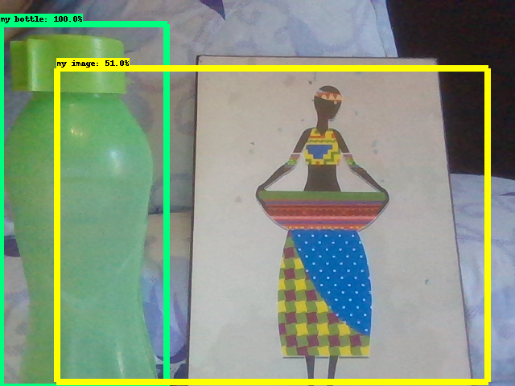

# Overview
The TensorFlow Object Detection API is an open source framework built on top of TensorFlow that makes it easy to construct, train and deploy object detection   models.

In this repository, I used SSD mobilenet pre-trained model which is trained on COCO dataset to train on my own dataset.

# Steps

## Tensorflow API setup

1. Download Tensorflow object detection repository from [here](https://github.com/tensorflow/models).

2. Download SSD (Single Shot Detector) mobile-net-v1 pre-trained model from [here](http://download.tensorflow.org/models/object_detection/ssd_mobilenet_v1_coco_2018_01_28.tar.gz). Inside the model directory you will find:
    
     * a graph proto (graph.pbtxt)
     
     * a checkpoint (model.ckpt.data-00000-of-00001, model.ckpt.index, model.ckpt.meta)
     
     * a frozen graph proto with weights baked into the graph as constants (frozen_inference_graph.pb) to be used for out of the box inference
     

3. Download SSD config file from [here](https://github.com/tensorflow/models/blob/master/research/object_detection/samples/configs/ssd_mobilenet_v1_coco.config).

## Data Generation

1. I took over 200 photos for 2 objects from my room and put them in data directory.

2. I annotated the images using a tool called LabelImg (by drawing a box around each object in each image) to generate xml file which contains the label data for each image.

3. I moved some of these images and their xml files to test directory and rest of them to train directory.

## Create Label Map and TensorFlow Records

1. Create pbtxt file, tensorFlow requires a label map, which namely maps each of the used labels to an integer values. This label map is used both by the training and detection processes. ( for example: id:1, name:my bottle. id:2, name:my image.).

2. Convert xml files to csv files by executing xmt_to_csv.py for both train and test data.

3. Create TFRecord file, convert the csv files of each dataset to record files (by executing generate_tfrecord.py) that serve as input data to the TensorFlow training model (A TFRecord file stores your data as a sequence of binary strings).

Finally, there should be two new files, named test.record and train.record, respectively.

## Configure a training pipeline
Move config file to object detection directory and make some changes (such as changing num classes, num examples, path to be configured,...) on it to be ready to the training process.

## Training the model
Copy train.py from legacy directory to object detection directory and start training.

## Monitor the training job
The progress of the training job can be monitored using TensorBoard. this tool allows you to coninuously monitor and visualise a number of different training/detection performance metrics, while your model is being trained. In order to do that, open a new instance of Anaconda Prompt and run " tensorboard --logdir='training' ".

After exporting the Inference Graph, I tested the model by the webcam in ipynb file.

 

